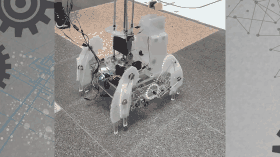
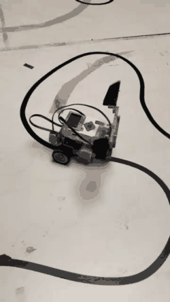
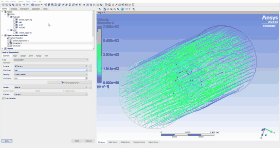
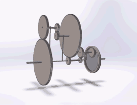
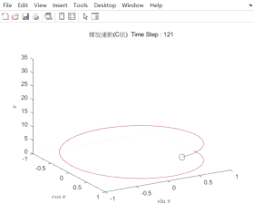

# College Portfolio

Coursework, projects and an internship from my B.S. in Mechanical Engineering at National Cheng Kung University (2020–2024).

**English** · [繁體中文](README.zh-TW.md)

## Highlights

<table>
<tr>
<td align="center"> Retrieval and transport robots handing off a part</td>
<td align="center"> EV3 line following</td>
<td align="center"> Fan CFD in Ansys Fluent (SGS)</td>
</tr>
<tr>
<td align="center"> Gear train simulation</td>
<td align="center"> 3D spiral trajectory (MATLAB)</td>
<td align="center"> Computer stand FEA</td>
</tr>
</table>

## Contents

| Folder | What's inside |
|---|---|
| [`Mechanical Project`](Mechanical%20Project) | Two-robot retrieve-and-transport system: videos and poster |
| [`Monographic study`](Monographic%20study) | Undergraduate research on vibration control of an optical inspection platform, with report and poster |
| [`SGS Inspection Intern`](SGS%20Inspection%20Intern) | Fan CFD, acoustic and structural analysis, plus a LabVIEW monitoring filter |
| [`Mechanical Design`](Mechanical%20Design) | Computer stand design with SolidWorks and Ansys stress analysis |
| [`Mechanical Drawing`](Mechanical%20Drawing) | CAD models: V8 engine, universal joint, vernier caliper, trailer hitch |
| [`Mechanism`](Mechanism) | Gear and planetary gear systems |
| [`Instrument and Measurement`](Instrument%20and%20Measurement) | Spindle vibration monitoring: FFT and filtering |
| [`Numerical Analysis`](Numerical%20Analysis) | Root-finding, rainfall maps and trajectory plots |
| [`Automatic_Control`](Automatic_Control) | EV3 line following and maze navigation |
| [`Club_Activities`](Club_Activities) | Swimming results, certificates and training |

The original videos (`.mp4`) are in each folder. The GIFs above are short clips taken from them.
